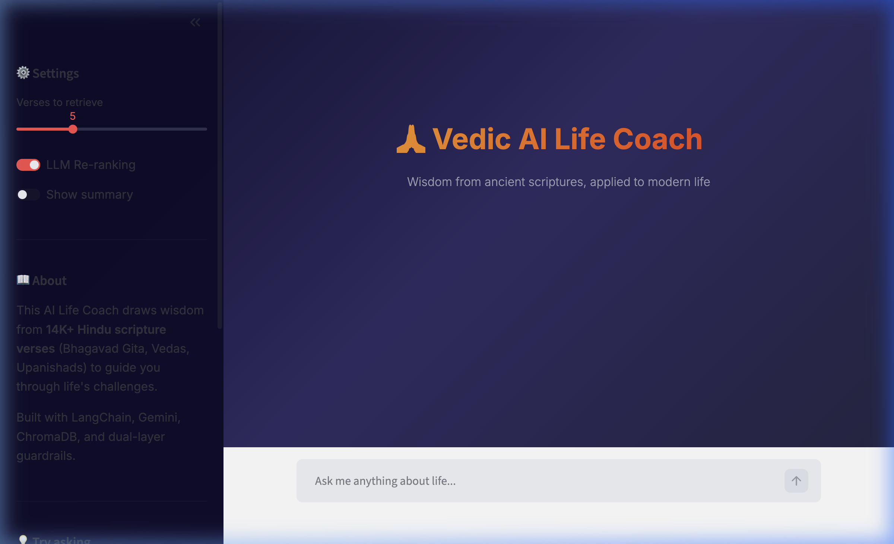

## RAG-Based Vedic Life Coach

> A context-aware, conversational AI that gives you life guidance grounded in Hindu scriptures, not generic LLM answers.



Ask it anything about life, relationships, career confusion, anger, purpose, grief and it pulls **real verses** from the Bhagavad Gita, Vedas, and Upanishads, then weaves them into practical, modern advice.

---

## What makes this different?

Most AI chatbots hallucinate spiritual advice. This one **can't** , every answer is grounded in actual scripture chunks retrieved from a vector database, with verse-level citations you can verify.

**The pipeline:**

```
Question → Guardrails → Embed → ChromaDB Search → LLM Re-rank → Gemini Pro → Cited Answer
```

**Two-layer guardrails** catch harmful content (regex) and off-topic questions (LLM classifier) *before* any expensive API calls happen.

---

## Quick Start

### 1. Clone the repo

```bash
git clone https://github.com/souravad1998/agentic_rag.git
cd agentic_rag
```

### 2. Set up Python environment

You'll need Python 3.13+ and [uv](https://docs.astral.sh/uv/getting-started/installation/) (recommended) or pip.

```bash
# with uv (recommended)
uv sync

# or with pip
python -m venv .venv
source .venv/bin/activate
pip install -r requirements.txt
```

### 3. Add your Gemini API key

Create a `dev.properties` file in the project root:

```
GEMINI_API_KEY=your_api_key_here
```

Get a free API key from [Google AI Studio](https://aistudio.google.com/apikey).

### 4. Add scripture data

Place your CSV file at `data/bhagavad_gita_verses.csv`. The CSV should have these columns:

| Column | Description |
|---|---|
| `chapter_number` | Chapter number |
| `chapter_verse` | Verse reference (e.g., "2.47") |
| `chapter_title` | Chapter name |
| `translation` | English translation of the verse |

### 5. Run it

```bash
# Streamlit UI (recommended)
uv run streamlit run app.py

# CLI mode
uv run python main.py
```

Open **http://localhost:8501** and start asking questions.

---

## Project Structure

```
agentic_rag/
├── app.py                 # Streamlit chat UI
├── main.py                # CLI entry point
├── src/
│   ├── config.py          # API keys, model names, paths
│   ├── embedding.py       # Gemini embedding wrapper
│   ├── vectorstore.py     # ChromaDB persistent store
│   ├── data_loader.py     # CSV loader + text splitter
│   ├── search.py          # Retriever + LLM re-ranking
│   ├── prompt_builder.py  # System prompt + message builder
│   ├── guardrails.py      # Safety filter + topic classifier
│   └── rag_pipeline.py    # End-to-end pipeline orchestration
├── data/
│   └── bhagavad_gita_verses.csv
├── notebook/
│   └── document.ipynb     # Original exploration notebook
└── assets/
    └── screenshot.png
```

---

## Tech Stack

| Component | Technology |
|---|---|
| **Embeddings** | Gemini Embedding 001 (3072-dim) |
| **Vector DB** | ChromaDB (persistent, local) |
| **Re-ranker** | Gemini 2.5 Flash |
| **Main LLM** | Gemini 2.5 Pro |
| **Framework** | LangChain |
| **UI** | Streamlit |
| **Guardrails** | Regex filter + LLM topic classifier |

---

## How the Guardrails Work

**Layer 1 — Keyword filter** (instant, zero cost):
Regex patterns catch harmful content (violence, self-harm, abuse). Responds with crisis helpline numbers.

**Layer 2 — LLM topic check** (Gemini Flash):
A strict few-shot prompt classifies whether the question is about life/spirituality or off-topic (cooking, coding, sports, etc.). Off-topic questions get a friendly redirect.

Both layers run *before* any retrieval or generation — saving API costs on bad queries.

---

## Example Queries

| Query | What happens |
|---|---|
| *"I feel lost in life"* | ✅ Retrieves relevant verses, generates guidance |
| *"How to drive a Mercedes?"* | 🛡️ Blocked by LLM topic filter |
| *"I want to stab someone"* | 🛡️ Blocked by keyword filter + crisis helpline |
| *"What is the meaning of karma?"* | ✅ Retrieves karma-related verses |

---

## License

MIT

---


